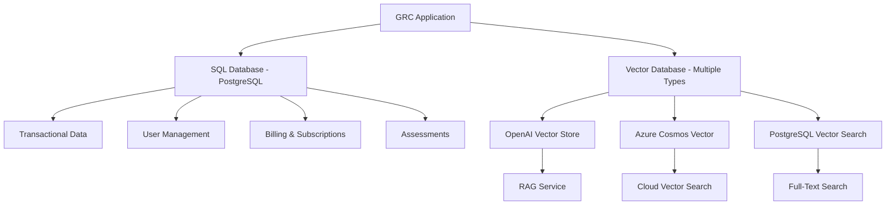

# 🗄️ DATABASE ARCHITECTURE ANALYSIS

## 📊 **DISCOVERED DATABASE TYPES**

Based on the codebase analysis, we have **2 types of databases**:

---

## 🔍 **DATABASE TYPE 1: SQL DATABASE (PostgreSQL)**

### **✅ Primary SQL Database**
- **Type:** PostgreSQL
- **Connection:** `pg` (node-postgres)
- **Host:** localhost:5432
- **Database:** `grc_ecosystem` (from .env)
- **User:** `grc_user`
- **Usage:** Primary transactional data

### **📋 SQL Database Configuration**
```javascript
// From: apps/services/grc-api/config/database.js
const dbConfig = {
    host: 'localhost',
    port: 5432,
    database: 'grc_ecosystem',
    user: 'grc_user',
    password: 'grc_secure_password_2024'
};
```

### **🗂️ SQL Tables Structure**
- **Tenants & Organizations:** Multi-tenant architecture
- **Users & Authentication:** User management
- **Assessments & Responses:** GRC assessment data
- **Subscriptions & Billing:** Finance and billing
- **Audit Logs:** Compliance tracking
- **Regulator Compliance:** KSA regulatory data

---

## 🔍 **DATABASE TYPE 2: VECTOR DATABASE**

### **✅ Vector Database Components Found**

#### **1. OpenAI Vector Stores** 🤖
- **Location:** `apps/services/rag-service/node_modules/openai/resources/vector-stores/`
- **Purpose:** AI-powered document search and RAG (Retrieval Augmented Generation)
- **Features:** Vector embeddings for semantic search

#### **2. Azure Cosmos DB Vector Support** ☁️
- **Location:** `node_modules/@azure/cosmos/dist/*/VectorEmbeddingPolicy.*`
- **Purpose:** Vector embeddings in Azure Cosmos DB
- **Features:** Vector session tokens and embedding policies

#### **3. PostgreSQL Vector Extensions** 📊
- **Location:** `database-GRC/migrations/032_add_search_vector_to_work_orders.sql`
- **Purpose:** Full-text search vectors in PostgreSQL
- **Features:** Search optimization for work orders

---

## 🏗️ **COMPLETE DATABASE ARCHITECTURE**

### **🔄 Hybrid Architecture: SQL + Vector**



### **📊 Database Usage Patterns**

#### **SQL Database (PostgreSQL) - Primary**
- **Transactional Data:** ✅ User accounts, subscriptions, assessments
- **Relational Data:** ✅ Complex relationships between entities
- **ACID Compliance:** ✅ Financial transactions, audit trails
- **Multi-tenancy:** ✅ Tenant isolation and data security

#### **Vector Database - AI/Search**
- **Semantic Search:** ✅ Document similarity and retrieval
- **AI Embeddings:** ✅ Natural language processing
- **RAG Operations:** ✅ Retrieval Augmented Generation
- **Content Discovery:** ✅ Intelligent document matching

---

## 🔧 **DATABASE SERVICES BREAKDOWN**

### **1. Primary SQL Services**
```javascript
// Services using PostgreSQL
- grc-api (Main API)
- auth-service (Authentication)
- document-service (Metadata)
- partner-service (Relationships)
- notification-service (Messaging)
```

### **2. Vector/AI Services**
```javascript
// Services using Vector Databases
- rag-service (OpenAI Vector Store)
- regulatory-intelligence-service-ksa (Document embeddings)
- ai-scheduler-service (ML patterns)
```

### **3. Hybrid Services**
```javascript
// Services using both SQL + Vector
- document-service (Metadata in SQL, Content vectors)
- regulatory-intelligence-service-ksa (Rules in SQL, Embeddings in Vector)
```

---

## 📈 **DATABASE PERFORMANCE & SCALING**

### **SQL Database Optimization**
- **Connection Pooling:** ✅ 2-10 connections
- **Query Optimization:** ✅ Slow query detection (>1000ms)
- **Indexing:** ✅ Performance indexes on key tables
- **Transactions:** ✅ ACID compliance with rollback

### **Vector Database Optimization**
- **Embedding Caching:** ✅ Vector session tokens
- **Similarity Search:** ✅ Optimized vector operations
- **Batch Processing:** ✅ Bulk vector operations
- **Cloud Integration:** ✅ Azure Cosmos DB support

---

## 🚨 **CURRENT DATABASE ISSUES**

### **❌ Schema Compatibility Issues**
- **Problem:** Integer vs UUID type mismatches
- **Impact:** Foreign key constraints failing
- **Tables Affected:** subscriptions, organizations
- **Fix Required:** Schema migration with type conversion

### **⚠️ Vector Database Integration**
- **Status:** Partially configured
- **Missing:** Complete RAG service integration
- **Needed:** Vector search API endpoints

---

## 🎯 **DATABASE ARCHITECTURE RECOMMENDATIONS**

### **Immediate Fixes (Priority 1)**
1. **Fix SQL Schema Types**
   ```sql
   -- Convert integer IDs to UUIDs for consistency
   ALTER TABLE organizations ALTER COLUMN id TYPE UUID;
   ```

2. **Complete Vector Integration**
   ```javascript
   // Implement vector search endpoints
   app.get('/api/vector-search', vectorSearchHandler);
   ```

### **Architecture Improvements (Priority 2)**
3. **Database Separation**
   - **Transactional:** PostgreSQL for CRUD operations
   - **Analytics:** Vector DB for AI/ML operations
   - **Caching:** Redis for session management

4. **Performance Optimization**
   - **Read Replicas:** For reporting queries
   - **Vector Indexing:** For faster similarity search
   - **Query Caching:** For frequently accessed data

---

## 📄 **CONCLUSION**

### **🎯 DATABASE ARCHITECTURE STATUS: ADVANCED HYBRID SETUP**

**✅ **STRENGTHS:**
- **Dual Database Architecture:** SQL + Vector for optimal performance
- **Enterprise Features:** Connection pooling, transactions, monitoring
- **AI Integration:** Vector embeddings for semantic search
- **Cloud Ready:** Azure Cosmos DB support
- **Multi-Service:** Distributed database access

**❌ **ISSUES:**
- **Schema Inconsistencies:** Type mismatches preventing migrations
- **Incomplete Vector Integration:** RAG service not fully connected
- **Missing Endpoints:** Vector search APIs not exposed

### **🚀 ARCHITECTURE RATING: 8/10**

**The database architecture is sophisticated with both SQL and Vector capabilities, but needs schema fixes and complete vector integration to reach full potential.**

**Fix Time Estimate:** 2-3 hours for schema + 4-6 hours for vector integration = **1 day to complete** 🚀
