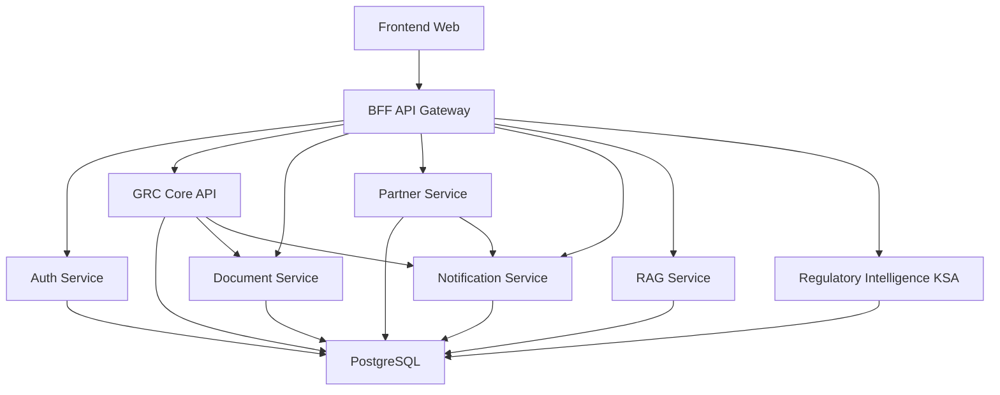

# GRC Ecosystem - Endpoints and Environment Components

## 🌐 **Service Architecture Overview**

### **Core Services & Ports**
| Service | Port | Internal Port | URL | Description |
|---------|------|---------------|-----|-------------|
| **Frontend (Web)** | 5174 | 5173 | http://localhost:5174 | React/Vite Frontend Application |
| **BFF (API Gateway)** | 3005 | 3000 | http://localhost:3005 | Backend for Frontend - API Gateway |
| **GRC Core API** | 3000 | 3000 | http://localhost:3000 | Main GRC Business Logic Service |
| **Auth Service** | 3001 | 3001 | http://localhost:3001 | Authentication & Authorization |
| **Document Service** | 3002 | 3002 | http://localhost:3002 | Document Processing & Storage |
| **Partner Service** | 3003 | 3003 | http://localhost:3003 | Partner Management |
| **Notification Service** | 3004 | 3004 | http://localhost:3004 | Email & Notification System |
| **AI Scheduler Service** | 3005 | 3005 | http://localhost:3005 | AI Task Scheduling |
| **RAG Service** | 3006 | 3006 | http://localhost:3006 | Retrieval Augmented Generation |
| **Regulatory Intelligence (KSA)** | 3008 | 3008 | http://localhost:3008 | KSA Regulatory Intelligence |
| **PostgreSQL Database** | 5433 | 5432 | postgres://localhost:5433 | Shared Database |

---

## 🔗 **API Endpoints by Service**

### **🔐 Authentication Service (Port 3001)**
```
Base URL: http://localhost:3001

Health & Status:
GET    /api/health                    # Service health check

Authentication:
POST   /api/auth/login               # User login
POST   /api/auth/register            # User registration
POST   /api/auth/logout              # User logout
POST   /api/auth/refresh             # Refresh JWT token
GET    /api/auth/profile             # Get user profile
PUT    /api/auth/profile             # Update user profile
POST   /api/auth/forgot-password     # Password reset request
POST   /api/auth/reset-password      # Password reset confirmation
```

### **🏢 GRC Core API Service (Port 3000)**
```
Base URL: http://localhost:3000

Organizations:
GET    /api/organizations            # List organizations
POST   /api/organizations            # Create organization
GET    /api/organizations/:id        # Get organization details
PUT    /api/organizations/:id        # Update organization
DELETE /api/organizations/:id        # Delete organization

Assessments:
GET    /api/assessments              # List assessments
POST   /api/assessments              # Create assessment
GET    /api/assessments/:id          # Get assessment details
PUT    /api/assessments/:id          # Update assessment
DELETE /api/assessments/:id          # Delete assessment
POST   /api/assessments/:id/submit   # Submit assessment

Assessment Templates:
GET    /api/assessment-templates     # List templates
POST   /api/assessment-templates     # Create template
GET    /api/assessment-templates/:id # Get template details
PUT    /api/assessment-templates/:id # Update template
DELETE /api/assessment-templates/:id # Delete template

Assessment Responses:
GET    /api/assessment-responses     # List responses
POST   /api/assessment-responses     # Create response
GET    /api/assessment-responses/:id # Get response details
PUT    /api/assessment-responses/:id # Update response

Assessment Evidence:
GET    /api/assessment-evidence      # List evidence
POST   /api/assessment-evidence      # Upload evidence
GET    /api/assessment-evidence/:id  # Get evidence details
DELETE /api/assessment-evidence/:id  # Delete evidence

Compliance Reports:
GET    /api/compliance-reports       # List reports
POST   /api/compliance-reports       # Generate report
GET    /api/compliance-reports/:id   # Get report details
PUT    /api/compliance-reports/:id   # Update report
DELETE /api/compliance-reports/:id   # Delete report

Evidence Library:
GET    /api/evidence-library         # List evidence items
POST   /api/evidence-library         # Add evidence item
GET    /api/evidence-library/:id     # Get evidence item
PUT    /api/evidence-library/:id     # Update evidence item
DELETE /api/evidence-library/:id     # Delete evidence item

Frameworks:
GET    /api/frameworks               # List GRC frameworks
GET    /api/frameworks/:id           # Get framework details

Controls:
GET    /api/controls                 # List controls
GET    /api/controls/:id             # Get control details

Sector Controls:
GET    /api/sector-controls          # List sector-specific controls
GET    /api/sector-controls/:sector  # Get controls by sector

Regulators:
GET    /api/regulators               # List regulators
GET    /api/regulators/:id           # Get regulator details

Users:
GET    /api/users                    # List users
POST   /api/users                    # Create user
GET    /api/users/:id                # Get user details
PUT    /api/users/:id                # Update user
DELETE /api/users/:id                # Delete user

Tenants:
GET    /api/tenants                  # List tenants
POST   /api/tenants                  # Create tenant
GET    /api/tenants/:id              # Get tenant details
PUT    /api/tenants/:id              # Update tenant
DELETE /api/tenants/:id              # Delete tenant

Workflow:
GET    /api/workflow                 # List workflow items
POST   /api/workflow                 # Create workflow item
GET    /api/workflow/:id             # Get workflow details
PUT    /api/workflow/:id             # Update workflow
DELETE /api/workflow/:id             # Delete workflow

Dashboard:
GET    /api/dashboard                # Get dashboard data
GET    /api/dashboard/stats          # Get statistics
GET    /api/dashboard/charts         # Get chart data

Settings:
GET    /api/settings                 # Get system settings
PUT    /api/settings                 # Update settings

Tables:
GET    /api/tables                   # List database tables
GET    /api/tables/:table            # Get table data

KSA GRC:
GET    /api/ksa-grc                  # KSA-specific GRC endpoints
POST   /api/ksa-grc                  # Create KSA GRC item
GET    /api/ksa-grc/:id              # Get KSA GRC details

Microsoft Auth:
GET    /api/microsoft-auth           # Microsoft SSO endpoints
POST   /api/microsoft-auth/callback  # Microsoft auth callback

Documents:
GET    /api/documents                # List documents
POST   /api/documents                # Upload document
GET    /api/documents/:id            # Get document details
PUT    /api/documents/:id            # Update document
DELETE /api/documents/:id            # Delete document

Admin Routes:
GET    /api/admin/platform           # Platform admin endpoints
GET    /api/admin/supervisor         # Supervisor admin endpoints
```

### **📄 Document Service (Port 3002)**
```
Base URL: http://localhost:3002

Documents:
GET    /api/documents                # List documents
POST   /api/documents/upload         # Upload document
GET    /api/documents/:id            # Get document
PUT    /api/documents/:id            # Update document
DELETE /api/documents/:id            # Delete document
GET    /api/documents/:id/download   # Download document
POST   /api/documents/:id/process    # Process document (OCR, etc.)
GET    /api/documents/:id/metadata   # Get document metadata
```

### **🤝 Partner Service (Port 3003)**
```
Base URL: http://localhost:3003

Partners:
GET    /api/partners                 # List partners
POST   /api/partners                 # Create partner
GET    /api/partners/:id             # Get partner details
PUT    /api/partners/:id             # Update partner
DELETE /api/partners/:id             # Delete partner

Collaborations:
GET    /api/collaborations           # List collaborations
POST   /api/collaborations           # Create collaboration
GET    /api/collaborations/:id       # Get collaboration details
PUT    /api/collaborations/:id       # Update collaboration
DELETE /api/collaborations/:id       # Delete collaboration

Resources:
GET    /api/resources                # List shared resources
POST   /api/resources                # Create resource
GET    /api/resources/:id            # Get resource details
PUT    /api/resources/:id            # Update resource
DELETE /api/resources/:id            # Delete resource
```

### **📧 Notification Service (Port 3004)**
```
Base URL: http://localhost:3004

Notifications:
GET    /api/notifications            # List notifications
POST   /api/notifications            # Create notification
GET    /api/notifications/:id        # Get notification details
PUT    /api/notifications/:id        # Update notification
DELETE /api/notifications/:id        # Delete notification
POST   /api/notifications/send       # Send notification
GET    /api/notifications/templates  # List email templates
```

### **🤖 RAG Service (Port 3006)**
```
Base URL: http://localhost:3006

RAG Operations:
POST   /api/rag/query                # Query RAG system
POST   /api/rag/embed                # Create embeddings
GET    /api/rag/documents            # List indexed documents
POST   /api/rag/documents            # Index new document
DELETE /api/rag/documents/:id        # Remove document from index
GET    /api/rag/search               # Semantic search
POST   /api/rag/chat                 # Chat with documents
```

### **🏛️ Regulatory Intelligence KSA (Port 3008)**
```
Base URL: http://localhost:3008

Regulatory:
GET    /api/regulatory               # List regulatory items
POST   /api/regulatory               # Create regulatory item
GET    /api/regulatory/:id           # Get regulatory details
PUT    /api/regulatory/:id           # Update regulatory item
DELETE /api/regulatory/:id           # Delete regulatory item
GET    /api/regulatory/ksa           # KSA-specific regulations
GET    /api/regulatory/updates       # Latest regulatory updates
```

### **🌐 BFF (API Gateway) - Port 3005**
```
Base URL: http://localhost:3005

Proxied Routes:
/auth/*                             # → Auth Service (3001)
/api/auth/*                         # → Auth Service (3001)
/api/grc/*                          # → GRC API (3000)
/api/organizations/*                # → GRC API (3000)
/api/assessments/*                  # → GRC API (3000)
/api/grc-frameworks/*               # → GRC API (3000)
/api/documents/*                    # → Document Service (3002)
/api/partners/*                     # → Partner Service (3003)
/api/notifications/*                # → Notification Service (3004)
/api/rag/*                          # → RAG Service (3006)

Admin Routes:
GET    /api/admin/*                  # Admin-specific endpoints
```

---

## 🔧 **Environment Variables**

### **Database Configuration**
```env
DB_HOST=postgres
DB_PORT=5432
DB_NAME=grc_ecosystem
DB_USER=grc_user
DB_PASSWORD=grc_secure_password_2024
DB_POOL_MIN=2
DB_POOL_MAX=10
```

### **Authentication & Security**
```env
JWT_SECRET=grc_jwt_secret_key_ecosystem_2024_secure_change_in_production
JWT_EXPIRES_IN=24h
BCRYPT_ROUNDS=12
SERVICE_TOKEN=grc_service_token_2024_secure_change_in_production
```

### **Service URLs (Internal)**
```env
GRC_API_URL=http://grc-api:3000
AUTH_SERVICE_URL=http://auth-service:3001
DOCUMENT_SERVICE_URL=http://document-service:3002
PARTNER_SERVICE_URL=http://partner-service:3003
NOTIFICATION_SERVICE_URL=http://notification-service:3004
AI_SCHEDULER_SERVICE_URL=http://ai-scheduler-service:3005
RAG_SERVICE_URL=http://rag-service:3007
```

### **Frontend Configuration**
```env
FRONTEND_URL=http://localhost:5173
VITE_API_URL=http://localhost:3000
```

### **SMTP Configuration**
```env
SMTP_HOST=smtp.gmail.com
SMTP_PORT=587
SMTP_SECURE=false
SMTP_USER=your-email@gmail.com
SMTP_PASSWORD=your-app-password
SMTP_FROM=noreply@grc-system.com
```

### **Microsoft SSO (Optional)**
```env
MICROSOFT_CLIENT_ID=
MICROSOFT_CLIENT_SECRET=
MICROSOFT_TENANT_ID=
```

### **Rate Limiting**
```env
RATE_LIMIT_WINDOW_MS=900000
RATE_LIMIT_MAX_REQUESTS=100
```

### **File Upload**
```env
MAX_FILE_SIZE=52428800
UPLOAD_DIR=./uploads
```

---

## 🐳 **Docker Configuration**

### **Networks**
- **grc-ecosystem-network**: Bridge network for all services

### **Volumes**
- **postgres_data**: PostgreSQL data persistence
- **document_storage**: Document storage volume
- **document_uploads**: Upload directory volume
- **notification_templates**: Email template storage

### **Health Checks**
- **PostgreSQL**: `pg_isready` check every 10s
- **Auth Service**: HTTP health endpoint check every 30s

---

## 🚀 **Deployment Commands**

### **Development**
```bash
# Start all services
docker-compose -f infra/docker/docker-compose.ecosystem.yml up -d

# Start specific service
docker-compose -f infra/docker/docker-compose.ecosystem.yml up -d grc-api

# View logs
docker-compose -f infra/docker/docker-compose.ecosystem.yml logs -f

# Stop all services
docker-compose -f infra/docker/docker-compose.ecosystem.yml down
```

### **Production**
```bash
# Production deployment
docker-compose -f infra/docker/docker-compose.production.yml up -d

# With monitoring
docker-compose -f infra/docker/docker-compose.monitoring.yml up -d
```

---

## 📊 **Service Dependencies**



---

## 🔍 **Testing Endpoints**

### **Health Checks**
```bash
# Check all services
curl http://localhost:3001/api/health  # Auth Service
curl http://localhost:3000/api/health  # GRC API (if available)
curl http://localhost:3002/api/health  # Document Service (if available)
curl http://localhost:3003/api/health  # Partner Service (if available)
curl http://localhost:3004/api/health  # Notification Service (if available)
```

### **Authentication Test**
```bash
# Login test
curl -X POST http://localhost:3005/auth/login \
  -H "Content-Type: application/json" \
  -d '{"email":"test@example.com","password":"password"}'
```

### **API Gateway Test**
```bash
# Test BFF routing
curl http://localhost:3005/api/organizations
curl http://localhost:3005/api/assessments
```

---

## 📝 **Notes**

1. **Port Conflicts**: Ensure no other services are running on the specified ports
2. **Environment Variables**: Update `.env` file with production values
3. **Database**: PostgreSQL runs on port 5433 externally to avoid conflicts
4. **CORS**: Frontend URL is configured in CORS settings
5. **File Uploads**: Maximum file size is 50MB
6. **Rate Limiting**: 100 requests per 15-minute window
7. **JWT Tokens**: Expire after 24 hours by default
8. **Service Communication**: Internal services use Docker network names
9. **Health Checks**: All services should implement health endpoints
10. **Logging**: Morgan middleware provides request logging in development

---

*Last Updated: November 2024*
*GRC Ecosystem v1.0.0*