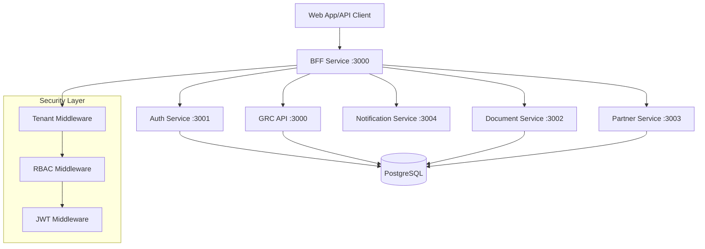
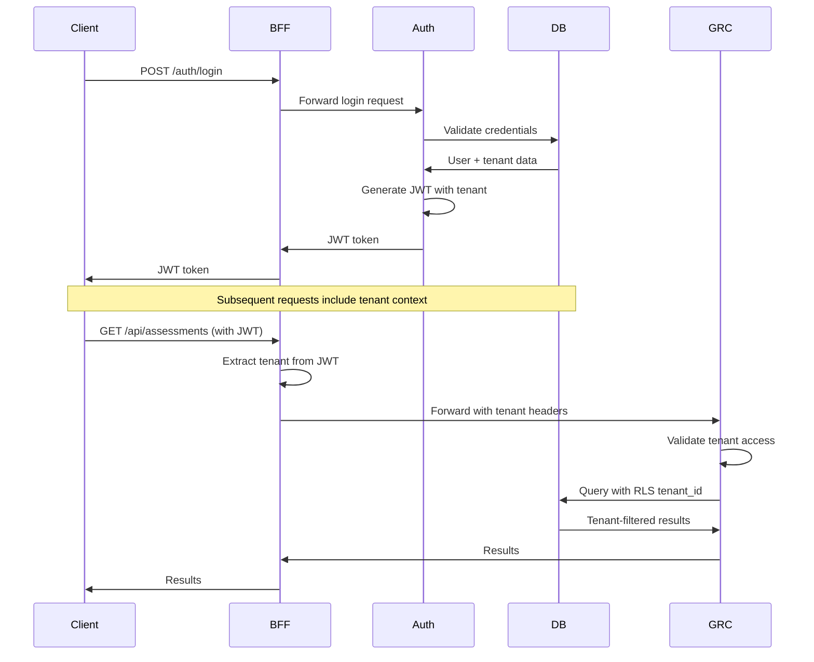
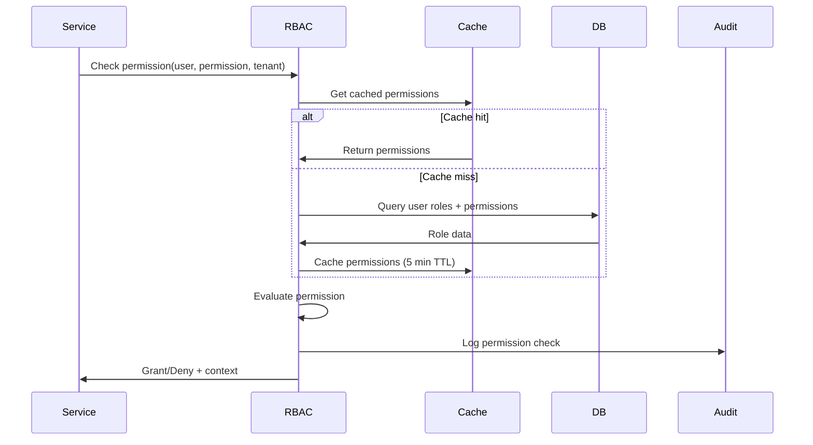

# 🏛️ **Multi-Tenant Multi-User Multi-Level RBAC Design Document**

**Project:** Assessment-GRC Platform
**Date:** November 10, 2025
**Version:** 1.0
**Status:** Design Phase

---

## 📋 **TABLE OF CONTENTS**

1. [Executive Summary](#executive-summary)
2. [Architecture Overview](#architecture-overview)
3. [Tenant Isolation Model](#tenant-isolation-model)
4. [RBAC Hierarchy & Permissions](#rbac-hierarchy--permissions)
5. [JWT Token Schema](#jwt-token-schema)
6. [Middleware Contracts](#middleware-contracts)
7. [Security Boundaries](#security-boundaries)
8. [Data Flow Diagrams](#data-flow-diagrams)
9. [Edge Cases & Error Handling](#edge-cases--error-handling)
10. [Testing Strategy](#testing-strategy)
11. [Implementation Plan](#implementation-plan)

---

## 📊 **EXECUTIVE SUMMARY**

The Assessment-GRC platform implements a **multi-tenant, multi-user, multi-level RBAC system** with the following key principles:

### **Core Design Principles**
- ✅ **Tenant Isolation**: Row-Level Security (RLS) with `tenant_id` in every table
- ✅ **Zero-Trust**: BFF controls tenant context; clients cannot set tenant
- ✅ **Hierarchical RBAC**: Role inheritance with permission aggregation
- ✅ **Service-to-Service Auth**: Dedicated service tokens vs user tokens
- ✅ **Audit Trail**: All permission checks logged with context

### **Security Guarantees**
- 🔒 **Tenant Data Isolation**: No cross-tenant data leakage
- 🔒 **Role Enforcement**: Centralized permission checks
- 🔒 **Token Security**: JWT with short expiry + refresh rotation
- 🔒 **Audit Compliance**: Full permission audit trail

---

## 🏗️ **ARCHITECTURE OVERVIEW**



### **Service Responsibilities**

| Service | Port | Responsibilities |
|---------|------|-----------------|
| **BFF** | 3000 | Tenant injection, service routing, client gateway |
| **Auth Service** | 3001 | Authentication, user management, JWT issuing |
| **GRC API** | 3000 | Core GRC operations with tenant isolation |
| **Document Service** | 3002 | Document processing with tenant storage |
| **Partner Service** | 3003 | Cross-tenant collaboration management |
| **Notification Service** | 3004 | Multi-tenant notification delivery |

---

## 🏢 **TENANT ISOLATION MODEL**

### **Database Schema Pattern**

```sql
-- Every business table includes tenant_id
CREATE TABLE assessments (
    id UUID PRIMARY KEY DEFAULT gen_random_uuid(),
    tenant_id UUID NOT NULL REFERENCES tenants(id),
    name TEXT NOT NULL,
    -- ... other fields
    created_at TIMESTAMP DEFAULT NOW()
);

-- Row-Level Security Policy
CREATE POLICY tenant_isolation ON assessments
    USING (tenant_id = current_setting('rls.tenant_id')::uuid);
```

### **Tenant Context Flow**

```javascript
// 1. Client Request (NO tenant header allowed)
Authorization: Bearer <user_jwt>

// 2. BFF extracts tenant from JWT
const { tenantId } = jwt.decode(token);
req.tenant = { id: tenantId, name: tenantName };

// 3. Service receives tenant context
app.use('/api/*', tenantMiddleware);

// 4. Database query with RLS
await db.query('SET rls.tenant_id = $1', [req.tenant.id]);
```

### **Tenant Types**

| Tenant Type | Description | Isolation Level |
|-------------|-------------|-----------------|
| **Organization** | Primary tenant (company/entity) | Full isolation |
| **Department** | Sub-tenant within organization | Shared data with parent |
| **Project** | Temporary tenant for specific assessments | Project-scoped isolation |

---

## 👥 **RBAC HIERARCHY & PERMISSIONS**

### **Role Hierarchy**

```
System Level:
├── super_admin (Global access, all tenants)
└── system_operator (Global read, limited write)

Organization Level:
├── org_admin (Full org access)
├── org_manager (Org read/write, no user management)
└── org_viewer (Org read-only)

Department Level:
├── dept_admin (Department full access)
├── dept_manager (Department read/write)
└── dept_member (Department read, limited write)

Project Level:
├── project_lead (Project full access)
├── project_member (Project read/write)
└── project_viewer (Project read-only)

External:
├── partner_admin (Cross-tenant collaboration)
├── partner_user (Limited partner access)
└── auditor (Audit read-only access)
```

### **Permission Categories**

```javascript
const PERMISSIONS = {
  // System Administration
  'system:admin': 'Full system administration',
  'system:read': 'System-wide read access',

  // Organization Management
  'org:admin': 'Organization administration',
  'org:users:manage': 'Manage organization users',
  'org:settings:write': 'Modify organization settings',
  'org:read': 'Read organization data',

  // Assessment Management
  'assessment:create': 'Create new assessments',
  'assessment:edit': 'Edit assessments',
  'assessment:delete': 'Delete assessments',
  'assessment:read': 'Read assessments',
  'assessment:submit': 'Submit assessments',
  'assessment:approve': 'Approve assessments',

  // Document Management
  'document:upload': 'Upload documents',
  'document:download': 'Download documents',
  'document:delete': 'Delete documents',
  'document:share': 'Share documents with partners',

  // Partner Collaboration
  'partner:invite': 'Invite partner organizations',
  'partner:manage': 'Manage partner relationships',
  'partner:share': 'Share resources with partners',

  // Audit & Reporting
  'audit:read': 'Read audit logs',
  'report:generate': 'Generate reports',
  'report:export': 'Export reports'
};
```

### **Role-Permission Matrix**

| Role | Assessment | Documents | Partners | Users | System |
|------|------------|-----------|----------|-------|--------|
| **super_admin** | All | All | All | All | All |
| **org_admin** | All | All | Manage | Manage | Read |
| **org_manager** | CRUD | CRUD | Read | Read | None |
| **dept_admin** | Dept CRUD | Dept CRUD | Read | Dept Manage | None |
| **project_lead** | Proj CRUD | Proj CRUD | Read | Proj Manage | None |
| **project_member** | Proj R/W | Proj R/W | None | None | None |
| **partner_admin** | Shared Read | Shared CRUD | Manage | None | None |
| **auditor** | Read | Read | Read | Read | Audit |

---

## 🔐 **JWT TOKEN SCHEMA**

### **User JWT Structure**

```javascript
{
  // Standard JWT Claims
  "iss": "assessment-grc-auth",
  "aud": "assessment-grc-services",
  "iat": 1699635600,
  "exp": 1699639200,  // 1 hour expiry
  "jti": "uuid-token-id",

  // User Claims
  "userId": "uuid",
  "email": "user@company.com",
  "firstName": "John",
  "lastName": "Doe",

  // Tenant Claims
  "tenantId": "uuid",
  "tenantCode": "ACME001",
  "tenantName": "ACME Corporation",
  "tenantType": "organization",

  // Role Claims
  "roles": [
    {
      "id": "uuid",
      "name": "org_admin",
      "displayName": "Organization Administrator",
      "tenantId": "uuid",
      "permissions": ["org:admin", "assessment:all", "document:all"]
    }
  ],

  // Context Claims
  "sessionId": "uuid",
  "loginTime": 1699635600,
  "lastActivity": 1699638800,
  "ipAddress": "192.168.1.100",
  "userAgent": "Mozilla/5.0...",

  // Security Claims
  "scope": "api:read api:write",
  "authMethod": "password|sso|mfa",
  "mfaVerified": true
}
```

### **Service JWT Structure**

```javascript
{
  // Standard Claims
  "iss": "assessment-grc-auth",
  "aud": "assessment-grc-services",
  "iat": 1699635600,
  "exp": 1699725600,  // 24 hour expiry

  // Service Claims
  "serviceId": "document-service",
  "serviceName": "Document Processing Service",
  "serviceVersion": "1.2.0",

  // Permissions
  "scope": "service:internal",
  "permissions": ["system:read", "document:process", "notification:send"],

  // Context
  "tokenType": "service",
  "environment": "production"
}
```

---

## 🔧 **MIDDLEWARE CONTRACTS**

### **Tenant Middleware**

**Location:** `apps/bff/middleware/tenant.js`

```javascript
/**
 * Tenant Context Injection Middleware
 *
 * Responsibilities:
 * - Extract tenant from JWT
 * - Validate tenant access
 * - Inject tenant context
 * - Block client-controlled tenant headers
 */

const tenantMiddleware = async (req, res, next) => {
  // Input Contract
  const token = extractJWT(req);

  // Processing
  const { tenantId, tenantCode, tenantName } = jwt.decode(token);

  // Validation
  if (req.headers['x-tenant-id'] && req.headers['x-tenant-id'] !== tenantId) {
    return res.status(400).json({
      error: 'tenant_override_forbidden',
      message: 'Client cannot override tenant context'
    });
  }

  // Output Contract
  req.tenant = {
    id: tenantId,
    code: tenantCode,
    name: tenantName
  };

  // Inject into downstream headers
  req.headers['x-tenant-id'] = tenantId;
  req.headers['x-tenant-code'] = tenantCode;

  next();
};
```

### **RBAC Middleware**

**Location:** `shared/middleware/rbac.js`

```javascript
/**
 * Permission Check Middleware
 *
 * Responsibilities:
 * - Validate user permissions
 * - Handle role hierarchy
 * - Log permission checks
 * - Return structured errors
 */

const requirePermission = (permission) => {
  return async (req, res, next) => {
    // Input Contract
    const { user, tenant } = req;

    // Permission Check
    const hasPermission = await checkUserPermission(
      user.id,
      permission,
      tenant.id
    );

    // Audit Log
    await logPermissionCheck({
      userId: user.id,
      tenantId: tenant.id,
      permission,
      granted: hasPermission,
      endpoint: req.path,
      method: req.method,
      timestamp: new Date()
    });

    // Output Contract
    if (!hasPermission) {
      return res.status(403).json({
        error: 'permission_denied',
        message: `Required permission: ${permission}`,
        requiredPermission: permission,
        userRoles: user.roles.map(r => r.name),
        context: {
          userId: user.id,
          tenantId: tenant.id,
          endpoint: req.path
        }
      });
    }

    next();
  };
};
```

---

## 🛡️ **SECURITY BOUNDARIES**

### **Trust Boundaries**

```
┌─────────────────┐     ┌─────────────────┐     ┌─────────────────┐
│   Client Side   │────▶│      BFF        │────▶│    Services     │
│                 │     │                 │     │                 │
│ ❌ Untrusted    │     │ 🔒 Trusted      │     │ 🔒 Trusted      │
│ ❌ No tenant    │     │ ✅ Tenant inject│     │ ✅ Tenant valid │
│ ❌ No direct DB│     │ ✅ Auth required│     │ ✅ RBAC enforced│
└─────────────────┘     └─────────────────┘     └─────────────────┘
```

### **Security Controls**

| Layer | Control | Implementation |
|-------|---------|----------------|
| **Network** | TLS 1.3 | All service-to-service communication |
| **Authentication** | JWT + Refresh | Short-lived access tokens |
| **Authorization** | RBAC + RLS | Permission checks + database policies |
| **Input Validation** | Schema validation | JSON schema + SQL injection protection |
| **Audit** | Activity logging | All permission checks and data access |
| **Rate Limiting** | Per-tenant limits | Prevent DoS and abuse |

### **Threat Model**

| Threat | Mitigation |
|--------|------------|
| **Cross-tenant data access** | RLS policies + tenant validation |
| **Privilege escalation** | Role hierarchy validation |
| **Token theft** | Short expiry + refresh rotation |
| **SQL injection** | Parameterized queries + input validation |
| **DoS attacks** | Rate limiting + resource quotas |
| **Insider threats** | Audit logging + least privilege |

---

## 📊 **DATA FLOW DIAGRAMS**

### **Authentication Flow**



### **Permission Check Flow**



---

## ⚠️ **EDGE CASES & ERROR HANDLING**

### **Tenant Edge Cases**

| Scenario | Handling |
|----------|----------|
| **User belongs to multiple tenants** | JWT contains primary tenant; switch requires re-auth |
| **Tenant suspended/deleted** | Token validation fails; force logout |
| **Cross-tenant resource sharing** | Partner service handles with explicit permissions |
| **Tenant data migration** | Temporary read-only mode during migration |

### **RBAC Edge Cases**

| Scenario | Handling |
|----------|----------|
| **Role changes during session** | Cached permissions expire after 5 minutes |
| **Permission inheritance conflicts** | Most restrictive permission wins |
| **Circular role dependencies** | Role graph validation prevents cycles |
| **Temporary role assignments** | Expiry timestamps in JWT + periodic validation |

### **Error Response Schema**

```javascript
{
  "success": false,
  "error": "permission_denied|tenant_invalid|token_expired|role_insufficient",
  "message": "Human-readable error message",
  "details": {
    "code": "RBAC_001",
    "requiredPermission": "assessment:write",
    "userPermissions": ["assessment:read"],
    "context": {
      "userId": "uuid",
      "tenantId": "uuid",
      "endpoint": "/api/assessments/123",
      "method": "PUT"
    }
  },
  "timestamp": "2025-11-10T15:30:00Z",
  "requestId": "uuid"
}
```

---

## 🧪 **TESTING STRATEGY**

### **Test Categories**

1. **Unit Tests**
   - JWT validation
   - Permission calculation
   - Role hierarchy resolution

2. **Integration Tests**
   - Cross-service authentication
   - Tenant isolation verification
   - Permission enforcement

3. **Security Tests**
   - Cross-tenant access attempts
   - Privilege escalation attempts
   - Token manipulation tests

4. **Performance Tests**
   - Permission check latency
   - Concurrent user scaling
   - Database RLS performance

### **Test Scenarios Matrix**

| Test Type | Tenant A User | Tenant B User | Expected Result |
|-----------|---------------|---------------|-----------------|
| **Isolation** | Access Tenant A data | Access Tenant A data | ❌ Denied |
| **Cross-tenant** | Partner access Tenant B | Normal user access Tenant A | ✅ Allowed / ❌ Denied |
| **Role escalation** | Member claims admin | Admin access | ❌ Denied |
| **Token tampering** | Modified tenant in JWT | Access resources | ❌ Denied |

---

## 🚀 **IMPLEMENTATION PLAN**

### **Phase 1: Foundation (Week 1)**
1. Create shared RBAC middleware library
2. Implement tenant injection in BFF
3. Extract auth service from grc-api
4. Add RLS policies to existing tables

### **Phase 2: Enhancement (Week 2)**
5. Implement permission caching
6. Add audit logging
7. Create role management API
8. Implement token refresh rotation

### **Phase 3: Testing & Security (Week 3)**
9. Complete integration test suite
10. Security penetration testing
11. Performance optimization
12. Production deployment

### **Success Criteria**
- ✅ Zero cross-tenant data leaks
- ✅ All permission checks logged
- ✅ Sub-100ms permission check latency
- ✅ 99.9% authentication availability
- ✅ Full audit compliance

---

## 📚 **REFERENCES**

- [OWASP Authentication Cheat Sheet](https://cheatsheetseries.owasp.org/cheatsheets/Authentication_Cheat_Sheet.html)
- [NIST SP 800-63B Authentication Guidelines](https://pages.nist.gov/800-63-3/sp800-63b.html)
- [PostgreSQL Row Level Security](https://www.postgresql.org/docs/current/ddl-rowsecurity.html)
- [JWT Best Practices](https://tools.ietf.org/html/rfc8725)

---

**Document Status:** ✅ Complete
**Next Step:** Implement comprehensive test suite
**Review Required:** Security team approval before implementation
